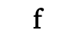
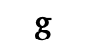
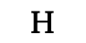
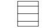

# Encoded Symbols

These are the encoded characters in the SymPub fonts. The characters from the font are shown in context.

Image | USV | Description
----- | --- | -----------
 | U+0023 | NUMBER SIGN
 | U+002A | ASTERISK
 | U+00A4 | CURRENCY SIGN
 | U+00A7 | SECTION SIGN
 | U+00B6 | PILCROW SIGN
 | U+00B7 | MIDDLE DOT
 | U+0394 | GREEK CAPITAL LETTER DELTA
 | U+2020 | DAGGER
 | U+2021 | DOUBLE DAGGER
 | U+2022 | BULLET
 | U+2023 | TRIANGULAR BULLET
 | U+203B | REFERENCE MARK
 | U+2207 | NABLA
 | U+221E | INFINITY
 | U+2295 | CIRCLED PLUS
 | U+2296 | CIRCLED MINUS
 | U+2297 | CIRCLED TIMES
 | U+2298 | CIRCLED DIVISION SLASH
 | U+230A | LEFT FLOOR
 | U+230B | RIGHT FLOOR
 | U+231E | BOTTOM LEFT CORNER
 | U+231F | BOTTOM RIGHT CORNER
 | U+2460 | CIRCLED DIGIT ONE
 | U+2461 | CIRCLED DIGIT TWO
 | U+2462 | CIRCLED DIGIT THREE
 | U+2463 | CIRCLED DIGIT FOUR
 | U+2464 | CIRCLED DIGIT FIVE
 | U+2465 | CIRCLED DIGIT SIX
 | U+2466 | CIRCLED DIGIT SEVEN
 | U+2467 | CIRCLED DIGIT EIGHT
 | U+2468 | CIRCLED DIGIT NINE
 | U+2469 | CIRCLED NUMBER TEN
 | U+246A | CIRCLED NUMBER ELEVEN
 | U+246B | CIRCLED NUMBER TWELVE
 | U+246C | CIRCLED NUMBER THIRTEEN
 | U+246D | CIRCLED NUMBER FOURTEEN
 | U+246E | CIRCLED NUMBER FIFTEEN
 | U+246F | CIRCLED NUMBER SIXTEEN
 | U+2470 | CIRCLED NUMBER SEVENTEEN
 | U+2471 | CIRCLED NUMBER EIGHTEEN
 | U+2472 | CIRCLED NUMBER NINETEEN
 | U+2473 | CIRCLED NUMBER TWENTY
 | U+24EB | NEGATIVE CIRCLED NUMBER ELEVEN
 | U+24EC | NEGATIVE CIRCLED NUMBER TWELVE
 | U+24ED | NEGATIVE CIRCLED NUMBER THIRTEEN
 | U+24EE | NEGATIVE CIRCLED NUMBER FOURTEEN
 | U+24EF | NEGATIVE CIRCLED NUMBER FIFTEEN
 | U+24F0 | NEGATIVE CIRCLED NUMBER SIXTEEN
 | U+24F1 | NEGATIVE CIRCLED NUMBER SEVENTEEN
 | U+24F2 | NEGATIVE CIRCLED NUMBER EIGHTEEN
 | U+24F3 | NEGATIVE CIRCLED NUMBER NINETEEN
 | U+24F4 | NEGATIVE CIRCLED NUMBER TWENTY
 | U+24FF | NEGATIVE CIRCLED DIGIT ZERO
 | U+25CA | LOZENGE
 | U+2605 | BLACK STAR
 | U+2606 | WHITE STAR
 | U+2723 | FOUR BALLOON-SPOKED ASTERISK
 | U+2724 | HEAVY FOUR BALLOON-SPOKED ASTERISK
 | U+2726 | BLACK FOUR POINTED STAR
 | U+2727 | WHITE FOUR POINTED STAR
 | U+272A | CIRCLED WHITE STAR
 | U+272F | PINWHEEL STAR
 | U+2734 | EIGHT POINTED BLACK STAR
 | U+2736 | SIX POINTED BLACK STAR
 | U+2738 | HEAVY EIGHT POINTED RECTILINEAR BLACK STAR
 | U+273B | TEARDROP-SPOKED ASTERISK
 | U+2756 | BLACK DIAMOND MINUS WHITE X
 | U+2776 | DINGBAT NEGATIVE CIRCLED DIGIT ONE
 | U+2777 | DINGBAT NEGATIVE CIRCLED DIGIT TWO
 | U+2778 | DINGBAT NEGATIVE CIRCLED DIGIT THREE
 | U+2779 | DINGBAT NEGATIVE CIRCLED DIGIT FOUR
 | U+277A | DINGBAT NEGATIVE CIRCLED DIGIT FIVE
 | U+277B | DINGBAT NEGATIVE CIRCLED DIGIT SIX
 | U+277C | DINGBAT NEGATIVE CIRCLED DIGIT SEVEN
 | U+277D | DINGBAT NEGATIVE CIRCLED DIGIT EIGHT
 | U+277E | DINGBAT NEGATIVE CIRCLED DIGIT NINE
 | U+277F | DINGBAT NEGATIVE CIRCLED NUMBER TEN
 | U+2E24 | BOTTOM LEFT HALF BRACKET
 | U+2E25 | BOTTOM RIGHT HALF BRACKET
 | U+2E4B | TRIPLE DAGGER
 | U+E0B1 | size reference - ascender
 | U+E0B2 | size reference - descender
 | U+E0B3 | size reference - uppercase
 | U+E0B4 | size reference - box
